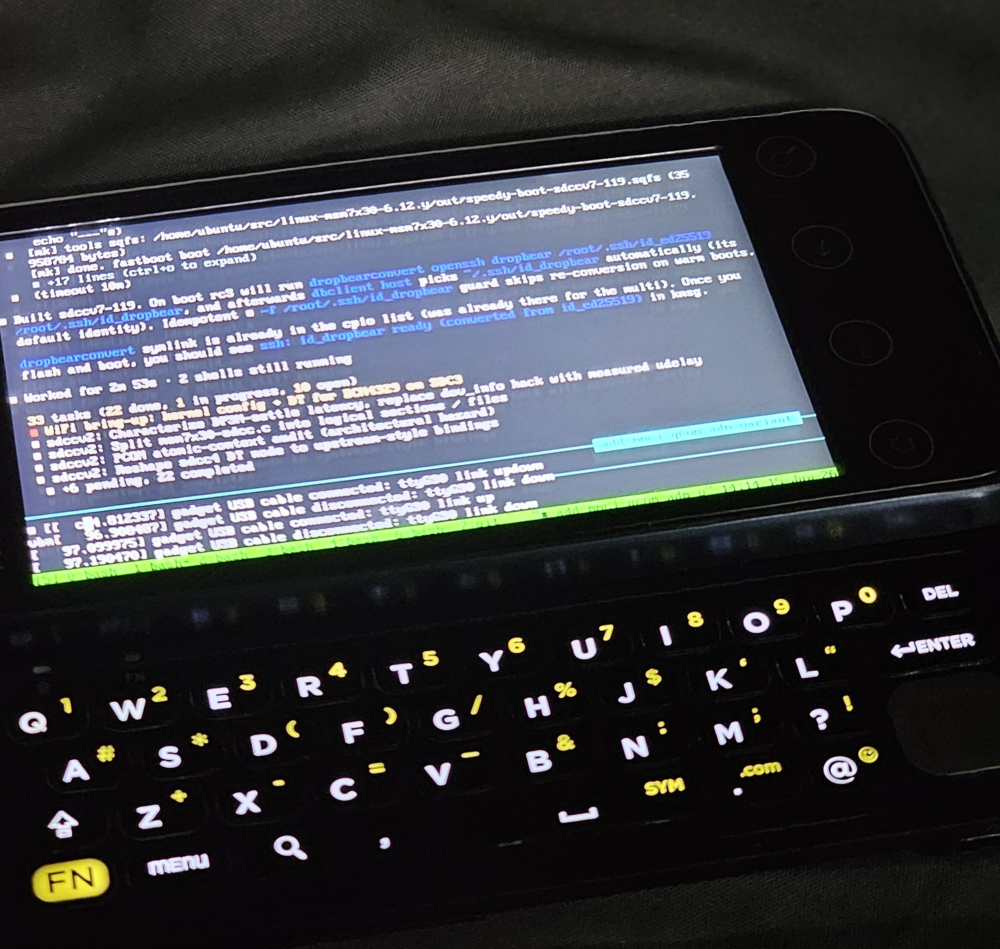

A modern port of Linux to a ten-year-old QWERTY phone.

[Link to the branch](https://github.com/tmzt/linux-stable-msm-dtsi)

### A note to the reader

This post is fully composed by me, a human, *fatto a mano*.

The port is accomplished with the help of Claude. It would have taken six months or longer to accomplish this port to the point I was able to reach without that tool. I have no plans on submitting this code in this form to upstream but designed it with that eventual goal. I would review and clean up the resulting patch by hand before that point. The history and context are included in the git history and you can see the progression, different approaches, and other details.

### The crazy idea

I was looking for a device that would allow me to interact with agentic AIs using ssh connections to tmux running on my Mac Mini. I considered a lot of possible 3d printed cyberdeck devices combining a Bluetooth keyboard with a smartphone. I also considered some mini laptops but couldn't find one that was really pocket sized and did what I wanted for the price I wanted to pay. Another possibility was the keyboard back for the PinePhone (I have an early version) but I've found it fairly slow and the PinePhone Pro is no longer made (and I couldn't find one).

So I started looking for an older device I was familiar with. Somewhere I have a T-Mobile G2 from when I was involved in the project of liberating that device early in the Android days. Unfortunately, I can't find it. I searched online for a similar device and came across the Sprint Evo 4G (HTC Speedy). It's the same hardware as the G2 (HTC Vision) but with a Wimax radio. $40 later and I had one on the way.

I want to be clear on my goals:

1. Boot a modern Linux kernel 6.12.y

2. Support fbcon terminal, keyboard, arrows, leds (keyboard backlight)

3. Support the wifi connection

Full graphical support, cellular radios, and other features are not goals of this project.

It turns out I needed one more feature:

4. USB connection (serial and network)

### The plug/unplug/battery pull development loop

I chose not to open the device or solder anything to it. I also was concerned about using the serial port connection which is limited to 1.8v and can expose the internals to overvoltage easily. For this reason, I didn't build a serial cable when I started this project. That was probably a mistake.

I had access to a recovery image that booted the device, a specific version of TWRP for the HTC Speedy. After obtaining an unlock code from HTC's website I was able to boot this image and was actually able to boot any other image via `fastboot`.

I don't remember if I tried USB first or framebuffer (or if I enabled the USB and expected it to work). For most ARM devices, the framebuffer is a region of memory that you write to and the result appears on the screen. This hardware doesn't work that way. Even writing to the framebuffer in the early kernel (from assembler) did nothing to update the screen. It was stuck on the splash screen and would not budge.

Of course, without serial and framebuffer output I had no way of knowing if the kernel was even booting. The one thing I knew was configured, since the HTC bootloader used it, was the vibrator. I had started with a long-term-support (LTS) branch of Linux, 6.12.y, which was before the recent removal of a number of the upstreamed MSM drivers which I believed I would need to rely on. (That may not be true). We'll call this the "upstream" kernel. I also pointed Claude at a "downstream" branch `htc-msm-7x30` which it could reference, get the addresses of the hardware and firmware devices and registers. Claude was able to find the address of the SSBI device and map the vibrator port. This gave me a beacon I could use to step through the early kernel, decompression, and early driver init.

### Getting the drivers to work

The framebuffer on this device is mapped to the MDP4 chip, but the display is connected to the chip (and the CPU) via the MDDI bus. The panel itself has it's own framebuffer. This was designed originally for flip phones that had a small flexible (FPC) connection through the hinge which wouldn't allow for a parallel panel connection.

As it turns out, the intended use was to program the MDP4 to scanout to the MDDI bus and push update packets itself. I had been trying to use the CPU to write these packets and it seemed to stop working after the first update. Later I found out the kernel was actually crashing after this which was preventing further updates.

The USB device was left active and would "chirp" high-speed support but fail to respond on ep0 and enumerate. This device needed a full init of the UDC connector which couldn't be accomplished just trough ULPI. The solution was to use the custom ONC RPC protocol. There's a modern driver in the upstream kernel for Qualcomm's replacement for this protocol and I followed that pattern and implemented a new socket-based protocol QCONCRPC. This enabled me to init the USB stack and finally brought up the USB stack. (Later I would find that this driver wasn't needed while implementing USB support for LK2nd which worked without the ONC RPC init, and I ended up backporting that to Linux.)

### MMC and Wifi

Getting the eMMC and wifi drivers to work turned out to take multiple days, multiple approaches, and even switching drivers. There's an older HSUSB driver which I first tried porting, calling it `msm_7x30`, based on the existing downstream driver `msm_sdcc`.

There's another newer, more supported driver called mmci, supporting the PL8xx chip IP which is what the Qualcomm chip IP is based on. After trying get the msm_7x30 driver working for wifi, I ended up switching over to `mmci` using PIO-only (no DMA). This finally got the wifi driver to the point that firmware download worked and the network device came up. (It also turns out that there are some timing based issues which means it only works when certain debug levels are enabled, or a delay is put in it's place. I don't have an answer to that part).

I wanted to support only one MMC driver so I decided to get eMMC working correctly with the same driver. First I implemented a PIO-only variant, then reintroduced DMA using Qualcomm ADM (advanced data mover).

### Weirdness and race conditions

After a long coding session attempting to get wifi working again with `mmci`, I decided to test an earlier build which I had saved. This worked when manually loading the drivers and it turned out to be a combination of the timing of loading the modules and the level of logging adding extra delays in the IO path. I had attempted to build in the mmc support in order to support a rootfs directly from the kernel and this prevented the wifi from successfully initializing. I then turned to using an initramfs to load the mmc driver and switch to the root filesystem, after loading the wifi driver before the mmc driver.

### Power management

I attempted multiple options to get a simple battery state of charge and charge status working. I tested both PCOM and Qualcomm ONCRPC, as well as accessing the hardware directly (this was mostly blocked) and reading from shared memory (which wasn't updated without a query).

The remaining issue is everything appears to be working for a while then shuts off. Weirdly this follows the default reboot path I chose, either reboot to Fastboot or normal reboot (which comes up in my ported LK2nd). It doesn't appear to be an undervoltage either or it would likely follow the default reboot path. Unlike a normal panic, it doesn't write the panic record to the ramconsole area.

### Final steps

The next step is to solder a 1.8v serial cable and attempt to log the final output, which would have been incredibly helpful for the entire project (lesson learned).

Once the power management issue is resolved, and the phone stops shutting off after a short time (like five minutes usually), I will work on a final patch. This is will give me a clean patchset that could be applied to upstream Linux without the noise, comments, etc. added by the LLM. I've also used the LLM to clean up comments reducing them to the minimum and instructing it to mimic the existing codebase.

